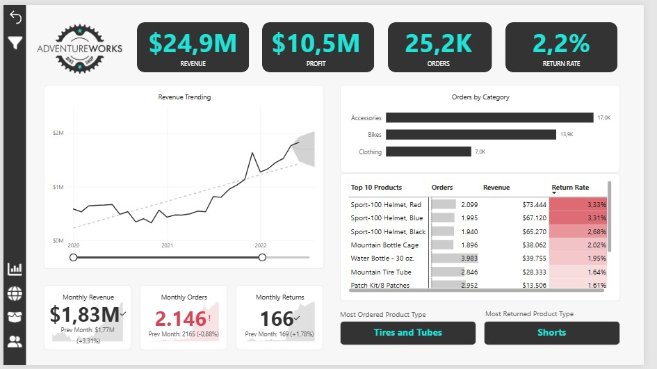

# 📊 Adventure Works Dashboard

<p align="center">
  
</p>

## 🚀 Sobre o Projeto

Este projeto foi desenvolvido no  utilizando a base de dados **Adventure Works**.

O dashboard foi criado com o objetivo de transformar dados comerciais em informações estratégicas, permitindo acompanhar indicadores de desempenho, analisar vendas e identificar oportunidades de negócio através de visualizações interativas e intuitivas.

---

## 🎯 Objetivos da Análise

- Monitorar KPIs de vendas
- Avaliar faturamento e lucro
- Identificar produtos com melhor performance
- Analisar comportamento dos clientes
- Comparar resultados por período
- Gerar insights para tomada de decisão

---

## 🛠️ Ferramentas Utilizadas

<p>
  
  
  
  
</p>

---

## 📸 Dashboard Preview

### 📌 Visão Geral

<p align="center">
  
</p>

---

## 📈 KPIs Monitorados

- 💰 Receita Total
- 📦 Quantidade de Vendas
- 📊 Lucro Total
- 📈 Crescimento Mensal
- 🛒 Produtos Mais Vendidos
- 🌎 Performance por Região
- 👥 Análise de Clientes

---

## 🧠 Principais Insights

- Identificação das categorias mais lucrativas
- Análise de sazonalidade nas vendas
- Comparação de performance entre regiões
- Produtos com maior volume de vendas
- Tendências comerciais ao longo do tempo

---

## 🗂️ Estrutura do Projeto

```txt
AdventureWorks-Dashboard/
│
├── images/
│   └── dashboard.png
│
├── AdventureWorks.pbix
│
└── README.md
```

---

## 📥 Como Utilizar

1. Clone este repositório:

```bash
git clone https://github.com/arthurcopaoli/AdventureWorks-Dashboard.git
```

2. Abra o arquivo `.pbix` no Power BI Desktop.

---

## 📚 Aprendizados

Durante o desenvolvimento deste projeto, foram aplicados conceitos de:

- Modelagem de dados
- Relacionamentos entre tabelas
- Criação de medidas DAX
- Tratamento de dados com Power Query
- Design de dashboards
- Storytelling com dados

---

## 👨‍💻 Autor

### Arthur Costa

<p>
  <a href="https://github.com/arthurcopaoli">
    
  </a>
</p>

---

## ⭐ Projeto desenvolvido para fins de estudo e portfólio em Data Analytics.
